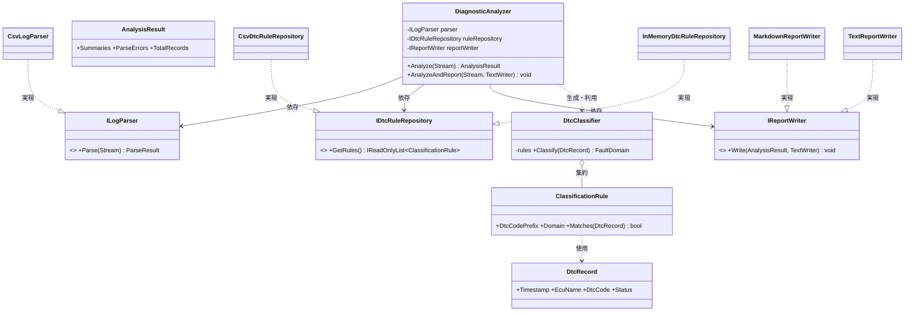

# DTCログ解析ツール クラス設計書(設計オプション比較付き)

対象:車両DTC(故障コード)ログ解析ツール/C# コンソールアプリ+クラスライブラリ+xUnit
目的:評価項目1(構成図・クラス図)、2(設計技法による詳細設計 L2)、6(設計との整合性評価)の立証材料

> **使い方の注意**:この設計はたたき台。⚠マークの箇所は「自分の判断で変える候補」。最低1箇所は自分の理由で変更し、AI利用ログに「AI案→自分の変更→理由」を記録すること。

---

## 1. 設計オプションの比較(3案)

面談でL2(自律的な技法選定)を主張するには「選ばなかった案を、理由付きで捨てた」ことを語れる必要がある。そのため3案を比較する。

### 案A:構造化設計(手続き型)

```
Program.cs
 ├─ static List<string[]> ReadCsv(string path)
 ├─ static List<DtcRow> ParseRows(List<string[]> raw)
 ├─ static string ClassifyDomain(string dtcCode)   // switch文でプレフィックス判定
 ├─ static Dictionary<string,int> Aggregate(...)
 └─ static void WriteReport(...)
```

- 設計手法:DFD(データフロー図)+段階的詳細化でモジュール分割。データは構造体/タプルで受け渡し。
- 長所:実装最速。処理が「入力→変換→出力」の一本道である限り見通しは良い。この規模なら1日で書ける。
- 短所:
  - **変更がswitch文と関数本体に散る**:新ログ形式(JSON)追加→ReadCsv/ParseRowsに分岐追加。新分類ルール→ClassifyDomainのswitch修正。変更のたびに既存コードを開ける(OCP違反)。
  - **テストがI/Oと密結合**:ReadCsvが実ファイル前提なので、テストにテスト用CSVファイルの用意が必須。分類ロジック単体を検証しにくい。

### 案B:オブジェクト指向+DIP(★採用案)

- レイヤ分離+インターフェイス抽象(詳細は第2章)。
- 長所:変更軸(ログ形式/分類ルール/出力形式)ごとに差し替え可能。Domain/Application層は純粋な単体テスト対象。
- 短所:案Aよりクラス数・初期コストが増える(体感1.5〜2倍)。

### 案C:フル装備OO(比較用の「過剰設計」案)

- ジェネリックなパイプライン `IPipelineStage<TIn,TOut>`、ルールをStrategy+Factoryで動的ロード、Microsoft.Extensions.DependencyInjectionでDIコンテナ導入、設定はappsettings.json…
- 長所:大規模・多人数・長寿命なら効く。
- 短所:クラス6〜8個規模のツールには**抽象のコストが利益を上回る**。読む人(=面談の上司)にも意図が伝わりにくい。

### 比較表と選定理由

| 観点 | 案A 構造化 | 案B OO+DIP | 案C フル装備 |
|---|---|---|---|
| 実装コスト | ◎ 最小 | ○ 中 | △ 大 |
| 変更容易性(ルール/形式追加) | △ 既存修正が散る | ◎ 実装クラス追加のみ | ◎ |
| テスト容易性 | △ I/O密結合 | ◎ モック注入可 | ◎ |
| この規模への適合 | ○ | ◎ | × 過剰 |

**選定理由(面談でそのまま言う版)**:
「本ツールには『分類ルールの追加』『ログ形式の追加』『レポート形式の追加』という**3つの変更軸が最初から予見される**ため、変更点をインターフェイスの背後に隔離できるOO設計を選びました。一方、DIコンテナや汎用パイプラインまで入れる案も検討しましたが、クラス8個規模では抽象のコストが利益を上回ると判断し、**手動DI(コンポジションルート)に留めました**。変更軸が『入力→変換→出力』の一本道だけなら構造化設計で十分でしたが、本件は違うと判断しました。」

→ 「捨てた理由」を両側(簡素すぎる案Aと過剰な案C)について言えるのがL2の証明。

---

## 2. 採用案:レイヤ構成とクラス設計

### 2-0. 依存関係(モジュール構成図の骨子)

```
CLI層(Program)
   │ 参照(組み立てのみ)
   ▼
Application層(DiagnosticAnalyzer)──依存──▶ ILogParser / IDtcRuleRepository / IReportWriter(抽象)
   │ 参照                                        ▲ 実現(implements)
   ▼                                             │
Domain層(DtcRecord, ClassificationRule,     Infrastructure層
        DtcClassifier, AnalysisResult)      (CsvLogParser, CsvDtcRuleRepository,
                                              MarkdownReportWriter)
```

重要ポイント:**インターフェイスはApplication層(利用側)に置く**。Infrastructure層がApplication層に依存する形になり、依存の矢印が「外側→内側」に揃う。これがDIPの「抽象の所有権は上位側」の意味。

### 2-1. Domain層(ビジネスの語彙。外部依存ゼロ)

**DtcRecord(record型)**
- 責務:DTCログ1行分の値を不変に保持する。
- 定義:
```csharp
public sealed record DtcRecord(
    DateTime Timestamp,
    string EcuName,
    string DtcCode,      // 例 "P0301"
    DtcStatus Status);
```
- なぜrecord型:①値の同一性で比較したい(テストのAssertが楽)②不変にすることで「パース後に誰かが書き換えた」系のバグを型で排除。classにする理由が特にない。

**DtcStatus(enum)**
```csharp
public enum DtcStatus { Active, Pending, Cleared, Unknown }
```
- ⚠設計判断ポイント:未知の文字列をUnknownに落とすか、パースエラーにするか。本設計は「Unknownに落として件数をレポートに出す」(ログ解析ツールは1行の異常で全体を止めないほうが実用的、という判断)。ここは自分の意見で変えてよい。

**FaultDomain(enum)**
```csharp
public enum FaultDomain { Powertrain, Chassis, Body, Network, Adas, Unknown }
```
- DTC標準のプレフィックス(P/C/B/U)と対応させると説明しやすい。

**ClassificationRule(record型)**
- 責務:「どのDTCコードパターンが、どの機能ドメインに属するか」という1本のルールを表し、レコードがルールに合致するか判定する。
```csharp
public sealed record ClassificationRule(string DtcCodePrefix, FaultDomain Domain)
{
    public bool Matches(DtcRecord record) =>
        record.DtcCode.StartsWith(DtcCodePrefix, StringComparison.OrdinalIgnoreCase);
}
```
- ⚠変更候補:プレフィックス一致でなく正規表現にする/優先度プロパティを足す等。「最初は最小で作り、必要になったら拡張する」と言えれば十分。

**DtcClassifier(ドメインサービス)**
- 責務:ルール集合を使って1レコードの所属ドメインを決定する。**分類の中核ロジックはここに集約**(テストの主戦場)。
```csharp
public sealed class DtcClassifier
{
    private readonly IReadOnlyList<ClassificationRule> _rules;
    public DtcClassifier(IReadOnlyList<ClassificationRule> rules);
    public FaultDomain Classify(DtcRecord record);
    // 最初に合致したルールを採用。どれにも合致しなければ FaultDomain.Unknown
}
```
- なぜApplication層でなくDomain層か:「DTCをどう分類するか」は入出力手段と無関係な**業務知識そのもの**だから。Application層に置くと、業務ルールがオーケストレーション(手順)と混ざる。

**AnalysisResult / DomainSummary(record型)**
- 責務:解析結果の集計値を保持する(表示方法は知らない)。
```csharp
public sealed record DomainSummary(FaultDomain Domain, int TotalCount, int ActiveCount);

public sealed record AnalysisResult(
    IReadOnlyList<DomainSummary> Summaries,
    IReadOnlyList<string> ParseErrors,   // 何行目がなぜ読めなかったか
    int TotalRecords);
```

### 2-2. Application層(手順のオーケストレーション+抽象の所有)

**ILogParser(インターフェイス)**
- 責務の契約:入力ソースからDtcRecord列を取り出す。読めない行は例外でなく結果として返す。
```csharp
public interface ILogParser
{
    ParseResult Parse(Stream input);
}

public sealed record ParseResult(
    IReadOnlyList<DtcRecord> Records,
    IReadOnlyList<string> Errors);
```
- ⚠設計判断ポイント(面談で必ず語れるように):**なぜ例外でなく結果型か**。「壊れた行が混ざったログ」はこのツールにとって*想定内の入力*であり、例外は「想定外」のためのもの。想定内のケースを例外で表すと、呼び出し側がtry-catchでフロー制御する歪んだコードになる。一方、ファイルが開けない等は想定外なのでIOExceptionをそのまま上げる——この線引きを言えると強い。
- なぜ引数がStreamでstring path でないか:パーサの責務は「バイト列の解釈」であり「ファイルを開くこと」ではない。Streamにするとテストで `MemoryStream` を渡せて実ファイル不要になる。

**IDtcRuleRepository(インターフェイス)**
```csharp
public interface IDtcRuleRepository
{
    IReadOnlyList<ClassificationRule> GetRules();
}
```

**IReportWriter(インターフェイス)**
```csharp
public interface IReportWriter
{
    void Write(AnalysisResult result, TextWriter output);
}
```

**DiagnosticAnalyzer(このツールの「主役」)**
- 責務:パース→分類→集計→出力の手順を編成する。**中身の詳細(CSVの読み方、ルールの持ち方、Markdownの書式)は一切知らない**。
```csharp
public sealed class DiagnosticAnalyzer
{
    private readonly ILogParser _parser;
    private readonly IDtcRuleRepository _ruleRepository;
    private readonly IReportWriter _reportWriter;

    public DiagnosticAnalyzer(
        ILogParser parser,
        IDtcRuleRepository ruleRepository,
        IReportWriter reportWriter);

    public AnalysisResult Analyze(Stream input);          // 解析して結果を返す
    public void AnalyzeAndReport(Stream input, TextWriter output); // 解析+出力
}
```
- Analyze の中身の流れ(シーケンス図の1本目はこれを描く):
  1. `_parser.Parse(input)` → ParseResult
  2. `_ruleRepository.GetRules()` → ルール集合で `DtcClassifier` を生成
  3. 各レコードを `Classify` し、FaultDomain別に集計
  4. AnalysisResult を組み立てて返す

### 2-3. Infrastructure層(抽象の実装。差し替え可能な「詳細」)

**CsvLogParser : ILogParser**
- 責務:CSV形式の解釈と入力検証(列数、日時形式、ステータス文字列の変換)。
```csharp
public sealed class CsvLogParser : ILogParser
{
    public ParseResult Parse(Stream input);
    // 検証内容:列数≠4→エラー行 / DateTime.TryParseExact失敗→エラー行 /
    //           未知ステータス→DtcStatus.Unknown(エラーにしない。件数は結果に出る)
}
```

**CsvDtcRuleRepository : IDtcRuleRepository**(ルールを外部CSVから読む)
**InMemoryDtcRuleRepository : IDtcRuleRepository**(既定ルールをコードに持つ。テストにも使う)
- 2実装用意すると「差し替えられる」ことのデモが一目でできる。

**MarkdownReportWriter : IReportWriter / TextReportWriter : IReportWriter**
- こちらも2実装で差し替えデモ。

### 2-4. CLI層(組み立て=コンポジションルート)

**Program**
```csharp
// 引数: dtctool <input.csv> [--format md|text] [--rules rules.csv]
var parser = new CsvLogParser();
IDtcRuleRepository rules = opts.RulesPath is null
    ? new InMemoryDtcRuleRepository()
    : new CsvDtcRuleRepository(opts.RulesPath);
IReportWriter writer = opts.Format == "md"
    ? new MarkdownReportWriter() : new TextReportWriter();

var analyzer = new DiagnosticAnalyzer(parser, rules, writer);
```
- なぜDIコンテナを使わないか:登録するクラスが8個程度なら、newの列挙(手動DI)のほうが依存関係が目で追える。コンテナは「登録が多く、ライフタイム管理が要る」規模で導入する——WPF業務でDIコンテナを使っている場合、その対比で語れると実務接続になる。

### 2-5. クラス図の元ネタ(Mermaid。draw.ioで清書する際の下書き)


- クラス図で「使い分けを明記」する4点:実現(点線三角)/依存(点線矢印)/集約(白菱形)/関連。継承は本設計では未使用——「継承よりコンポジションを優先した」も語りのネタになる。

---

## 3. DIPを外すと何が壊れるか(具体例)

### Before(DIP違反版)
```csharp
public sealed class DiagnosticAnalyzer
{
    public AnalysisResult Analyze(string csvPath)
    {
        var parser = new CsvLogParser();            // 具象を直接new
        var rules  = new CsvDtcRuleRepository("rules.csv");
        var result = parser.Parse(File.OpenRead(csvPath));
        ...
    }
}
```

具体的に壊れる3点:

1. **変更が中核クラスを直撃する(OCP違反)**
   「JSON形式のログも読みたい」となった瞬間、DiagnosticAnalyzer本体にif分岐を足すか書き換えるしかない。DIP版なら `JsonLogParser : ILogParser` を**追加するだけ**で、テスト済みのAnalyzerには指1本触れない。不具合修正の文脈で言えば「修正の影響範囲が中核に及ぶ設計」そのもの。

2. **単体テストが実ファイル・実CSVに縛られる**
   `new CsvLogParser()` が中にあると、Analyzerのテストは常に本物のCSVパースを通る。①テスト用CSVファイルの管理が必要 ②パーサのバグでAnalyzerのテストが落ちる(**故障の切り分けができないテスト**になる=評価項目8の観点!)③「パーサが空を返したら」「エラー100件返したら」等の異常系を作り込みにくい。DIP版ならフェイク(`FakeParser`)を注入して境界ケースを自在に作れる。

3. **並行作業・差し替えデモが不可能**
   ルールをDBに移す、レポートをHTMLにする、といった変更が全部Analyzer経由になる。面談での「実装クラスを差し替えても中核が無変更で動く」デモ(コンポジションルートの2行を書き換えるだけ)は、DIPがあって初めて成立する。

**面談での一言版**:「DIPを外すと、変更とテストの両方で"中核クラスを毎回開ける"ことになります。実際にDIP違反版も書いて、Analyzerの単体テストがパーサのバグで落ちる状況を確認しました」——⚠余裕があればDIP違反版をブランチに残して見せると説得力が跳ね上がる。

---

## 4. 面談想定Q&A(設計編)

**Q1. この規模でレイヤ分け+インターフェイス3つは過剰では?**
> 「規模だけ見れば過剰気味というのは同意です。判断基準は規模でなく**変更軸の数**で、本件はルール・入力形式・出力形式の3軸が予見されたため抽象化しました。逆に変更軸のないDtcClassifierの分類アルゴリズム自体は抽象化していません(IClassifierは作らなかった)。全部を抽象化しない線引きも意識しました。」

**Q2. なぜabstract classでなくinterfaceか?**
> 「共有したい実装(共通処理)がなく、契約だけを共有したいからです。C#は単一継承なので、基底クラスを使うと実装側の継承の自由を1枠消費します。共通処理が出てきた時点で、継承でなくヘルパーへの委譲を検討します。」

**Q3. インターフェイスをApplication層に置いたのはなぜ?Infrastructure層では?**
> 「抽象の所有権は利用側に置くのがDIPの本質だと理解しています。Infrastructure層に置くと、Application層がInfrastructure層を参照することになり、依存の向きが『内側→外側』に逆転して、詳細の変更が中核に波及する構造に戻ってしまいます。」

**Q4. パースエラーを例外にしなかった理由は?**
> 「壊れた行は本ツールにとって想定内の入力なので、結果型(ParseResult.Errors)で返し、レポートに件数と行番号を出します。ファイルが開けない等の想定外はIOExceptionをそのまま伝播させます。想定内/想定外で例外と結果型を使い分けました。」

**Q5. なぜrecord型?**
> 「パース後のデータは不変であるべきで、recordなら不変性と値ベースの等価比較が言語機能で手に入ります。テストでAssert.Equalが素直に書けるのも利点でした。」

**Q6. DIコンテナを使わなかったのは知らないから?**
> 「業務のWPFではDIコンテナを使っています。本件はクラス8個・ライフタイム管理不要なので、依存関係が目で追える手動のコンポジションルートを選びました。導入の閾値は『登録数が増えてnewの列挙が読めなくなる/ライフタイム制御が要る』時だと考えています。」

**Q7. 構造化設計だと本当にダメだった?**
> 「ダメではありません。実際、案Aとして検討しました(比較表を提示)。処理が一本道で変更軸がなければ構造化のほうが速くて読みやすい。本件は変更軸が3つあるためOOを選んだ、という**題材の性質に合わせた選定**です。」

---

## 5. 理解度セルフチェック(この設計を「自分のもの」にする基準)

- [ ] 3案(A/B/C)それぞれを「捨てた理由/選んだ理由」付きで、資料を見ずに2分で説明できる
- [ ] クラス図を白紙から手で描ける(全メソッドは不要。依存の向きと実現関係が正しければOK)
- [ ] 「ILogParserの引数がStreamなのはなぜ?」に即答できる
- [ ] DIP違反版のコードを口頭で再現し、壊れる3点を言える
- [ ] ⚠マークのうち最低1箇所を自分の判断で変更し、理由をAI利用ログに書いた
- [ ] 「DtcClassifierをApplication層に置いたら何が悪い?」に答えられる
